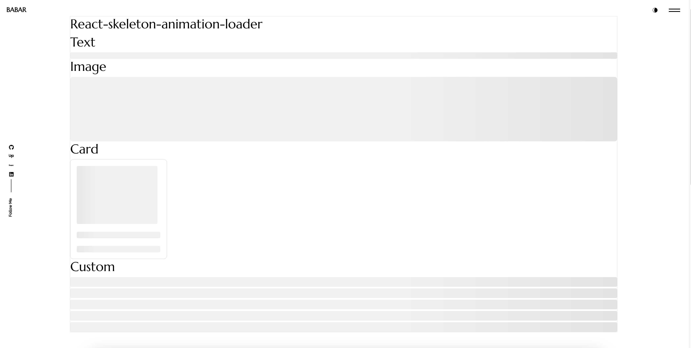

# React Skeleton Animation Loader

A lightweight and customizable React skeleton loader component with smooth animation effects. Ideal for improving user experience during content loading states.

## Installation

Install the package using npm or yarn:

```sh
npm install react-skeleton-animation-loader
```

or

```sh
yarn add react-skeleton-animation-loader
```

## Usage

### Basic Example

```jsx
import React, { useState, useEffect } from 'react';
import SkeletonLoader from 'react-skeleton-animation-loader';

const ExampleComponent = () => {
  const [loading, setLoading] = useState(true);

  useEffect(() => {
    setTimeout(() => setLoading(false), 3000);
  }, []);

  return (
    <div>
      <SkeletonLoader isLoading={loading}>
        <p>Content loaded!</p>
      </SkeletonLoader>
    </div>
  );
};

export default ExampleComponent;
```

## Props

| Prop             | Type                 | Default  | Description                                                    |
| ---------------- | -------------------- | -------- | -------------------------------------------------------------- |
| `type`           | `string`             | `'text'` | Specifies the skeleton type (`'text'`, `'image'`, `'custom'`). |
| `isLoading`      | `boolean`            | `true`   | Controls the loading state. If `true`, the skeleton appears.   |
| `children`       | `ReactNode`          | `null`   | Content to be displayed when `isLoading` is `false`.           |
| `skeletonWidth`  | `string` or `number` | `'100%'` | Custom width for the skeleton loader.                          |
| `skeletonHeight` | `string` or `number` | `'100%'` | Custom height for the skeleton loader.                         |
| `count`          | `number`             | `1`      | Number of skeleton elements (useful for `type='custom'`).      |

## Examples


### Image Skeleton Loader

```jsx
import React, { useState, useEffect } from 'react';
import SkeletonLoader from 'react-skeleton-animation-loader';

const ImageExample = () => {
  const [loading, setLoading] = useState(true);

  useEffect(() => {
    setTimeout(() => setLoading(false), 3000);
  }, []);

  return (
    <div>
      <SkeletonLoader isLoading={loading} type="image" skeletonWidth={200} skeletonHeight={200}>
        
      </SkeletonLoader>
    </div>
  );
};

export default ImageExample;
```

### Custom Skeleton List

```jsx
import React, { useState, useEffect } from 'react';
import SkeletonLoader from 'react-skeleton-animation-loader';

const ListExample = () => {
  const [loading, setLoading] = useState(true);

  useEffect(() => {
    setTimeout(() => setLoading(false), 3000);
  }, []);

  return (
    <div>
      <SkeletonLoader isLoading={loading} type="custom" count={5} skeletonHeight={20}>
        {[...Array(5)].map((_, index) => (
          <p key={index}>Item {index + 1}</p>
        ))}
      </SkeletonLoader>
    </div>
  );
};

export default ListExample;
```

### Card Skeleton Loader

```jsx
import React, { useState, useEffect } from 'react';
import SkeletonLoader from 'react-skeleton-animation-loader';

const CardExample = () => {
  const [loading, setLoading] = useState(true);

  useEffect(() => {
    setTimeout(() => setLoading(false), 3000);
  }, []);

  return (
    <div style={{ width: 300, padding: 20, border: '1px solid #ccc', borderRadius: 10 }}>
      <SkeletonLoader isLoading={loading} type="image" skeletonWidth={300} skeletonHeight={180} />
      <br/>
      <SkeletonLoader isLoading={loading} type="text" skeletonHeight={20} />
      <br/>
      <SkeletonLoader isLoading={loading} type="text" skeletonHeight={20} />
      <br/>
      {!loading && <button>Click Me</button>}
    </div>
  );
};

export default CardExample;
```

## Styling

You can customize the animation using CSS. Example:

```css
.skeleton-loader {
  background: linear-gradient(90deg, #f0f0f0 25%, #e0e0e0 50%, #f0f0f0 75%);
  background-size: 200% 100%;
  animation: shimmer 1.5s infinite;
}

@keyframes shimmer {
  0% { background-position: 200% 0; }
  100% { background-position: -200% 0; }
}
```

## License

MIT

